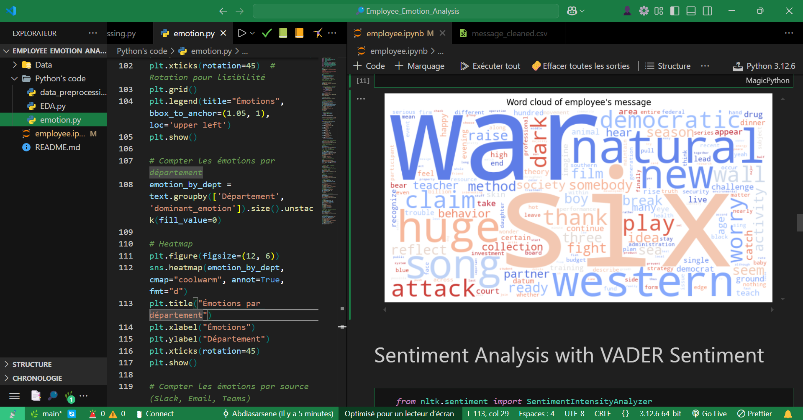

# Employee Emotion Analysis

## 📌 Description  
This project aims to analyze employee well-being through internal surveys and anonymized exchanges (Slack, Teams, emails). The goal is to identify dominant emotions (stress, satisfaction, frustration, etc.) and provide recommendations to improve workplace quality of life.  

## 🛠️ Technologies Used  
- **Python**: Text analysis and NLP  
- **NLTK / SpaCy**: Text preprocessing  
- **Transformers (BERT, RoBERTa)**: Emotion classification  
- **Matplotlib / Seaborn / Plotly**: Data visualization  
- **Pandas / NumPy**: Data manipulation  
- **Scikit-learn**: Model evaluation  

## 📂 Project Structure  
```
📁 Employee-Emotion-Analysis  
│── 📂 data               # Raw and processed data  
│── 📂 notebooks          # Jupyter notebooks for exploratory analysis  
│── 📂 models             # Trained models for emotion classification  
│── 📂 reports            # Analysis reports and visualizations  
│── 📂 scripts            # Python scripts for data processing  
│── README.md             # Project documentation  
│── requirements.txt      # Project dependencies  
```

## 📊 Methodology  
1. **Data Collection**: Gathering and anonymizing survey responses and messages.  
2. **Text Preprocessing**: Cleaning, tokenization, lemmatization, stopword removal.  
3. **Emotion Analysis**: Using NLP models to classify emotions.  
4. **Visualization**: Trends over time, word clouds, heatmaps.  
5. **Recommendations**: Providing insights for workplace well-being improvement.  

## 📈 Sample Visualizations  
📌 *Example of emotion trends over six months:*  
  

## 📌 Future Work  
- 🔹 Refining NLP models for better accuracy.  
- 🔹 Extending the dataset for more robust analysis.  
- 🔹 Exploring correlations between emotions and company performance metrics.  

## 📜 License  
This project is licensed under the MIT License.

